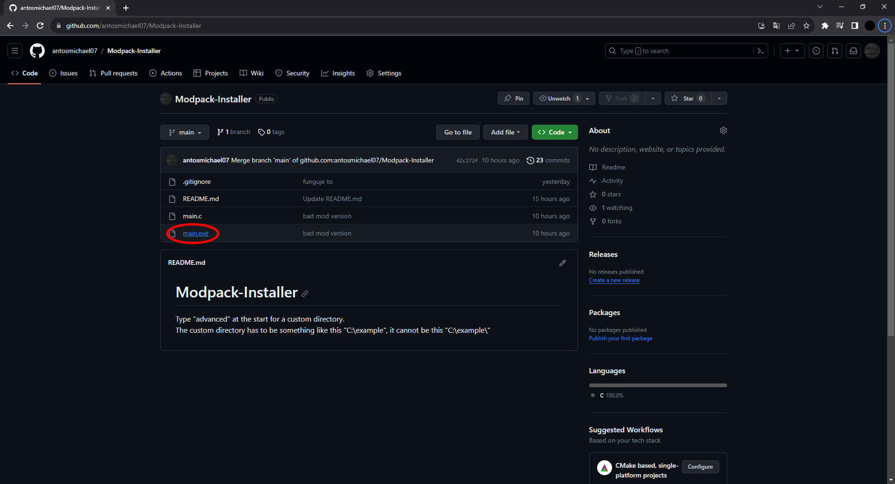
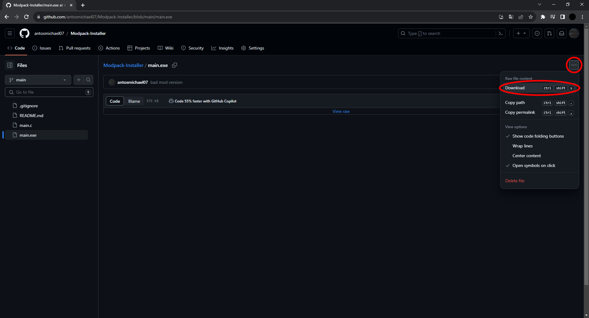

# Modpack-Installer

Type "advanced" at the start for a custom directory.  
The custom directory has to be something like this "C:\example", it cannot be this "C:\example\\"  

### How to download and install

Click on the main.exe  
  

Then click on the three dots and click download
  

After it's downloaded, open it and install.
